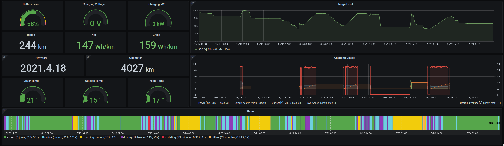
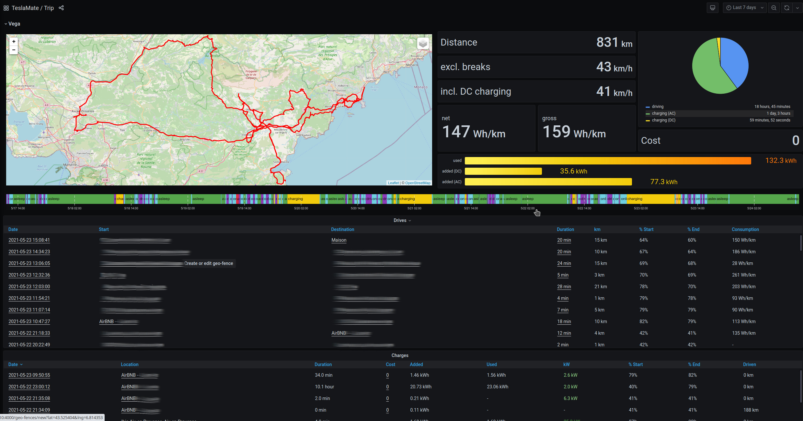

Tesla Model 3 SR+ (USA)
-----------------------

* [Usage](#usage)
* [Recharge](#recharge)
* [TCO](#tco)
   * [Estimations](#estimations)
   * [Prix au 100km](#prix-au-100km)
      * [Période d'usage](#période-dusage)
      * [Décôte](#décôte)
      * [Train de pneus](#train-de-pneus)
   * [Tableau récapitulatif](#tableau-récapitulatif)
* [Suivi des données de la voiture](#suivi-des-données-de-la-voiture)
* [Bilan après 2 mois](#bilan-après-2-mois)
   * [Conduite](#conduite)
      * [Remarques générales et points positifs qui m'ont marqués](#remarques-générales-et-points-positifs-qui-mont-marqués)
      * [Les points qui pêchent](#les-points-qui-pêchent)
          * [Autopilot](#autopilot)
          * [Ergonomie infotainment](#ergonomie-infotainment)
          * [Commandes automatisées](#commandes-automatisées)
   * [Astuces](#astuces)
* [Communauté](#communauté)

Dans cet article j'essaye de mettre à plat les différents éléments que
j'ai analysé avant de décider d'acheter une Tesla Model 3 SR+ 2021 et
également un peu de retour d’expérience

## Usage
J'ai estimé en terme de temps des longs trajets types (c'est le point
sur lequel j'avais le plus de "craintes"). J'ai utilisé pour cela [A
Better Route Planner](https://abetterrouteplanner.com/) en indiquant
le model Tesla Model 3 SR+ et LR et en faisant 4-5 longs trajets types
(famille, vacances, etc.)  J'ai ainsi pu comparer les temps de
trajets, en particulier les temps de recharges et leur nombre sur
chaque trajet et j'ai regardé à quel point ça déviait de notre usage
actuel en thermique si on alignait nos pauses habituelles (café,
déjeuner, etc.) avec les recharges. Cette étape pour moi était
importante afin de présenter le projet à ma moitié avec des choses
concrètes.

## Recharge
- Pas de prise sur parking de la résidence
- Charge au travail gratuite (Newmotion) T2 en 4kW
- Charge ponctuelle centre commercial gratuite 11kW
- Chargeurs publiques à moins d'1km (11kW)
- Superchargeurs 4 places à 6km, et pareil à 11km (pour une urgence,
  avant départ en vacance pour avoir 100%)

## TCO
Je voulais avoir une idée du coût de possession du véhicule (Total
Cost of Ownership) pour pouvoir le comparer avec mon ancien véhicule
thermique et le potentiel concurrent thermique à la Model 3. Mon
calcul s'est basé sur des données connues, et certaines inconnues que
j'ai donc estimées.

### Estimations

#### Prix au 100km
Mon modèle est 80% d’électricité gratuite et 20% payante au tarif
Tesla Supercharger 2021 (0,37€) J’estime que c'est un modèle
"pessimiste". Je ne prends évidemment pas en compte le fait que j'ai
les premiers 1500km de supercharge gratuits, et également que quand je
suis en vacances je suis plus souvent à payer mon énergie le coût de
vente EDF vers les 0,16€ (que ce soit à domicile sur 220V ou sur les
bornes locales à 11kW)

#### Période d'usage
- 15000km par ans (j'ai essayé de lisser mon usage pre-COVID ainsi que
  2020-2021, probablement pessimiste, sachant que plus je ferais de km
  plus je baisserais mon TCO comparé à une thermique)
- 4 ans

#### Décôte
En regardant les sites d'annonces et forums etc. je trouve une décôte
en gros de 25% sur la Model 3 pour ma durée de possession. C'est je
pense dans le calcul le facteur le plus impactant et le moins
fiable. Impact du model Y en Europe, mise en oeuvre de l'usine de
Berlin, réduction future des prix comme ça a été fait fin Décembre
2020.

#### Train de pneus
Changement estimé vers 40-50k km, avec un coût du train estimé à 700€
(en jantes aéro 18')

### Tableau récapitulatif

Je n'ai pas eu besoin de crédit pour la voiture, mais j'avais quand
même rajouté dans la simulation la possibilité de prendre 20k€ à la
banque à 1,74% pendant 4 ans, ça faisait remonter le TCO mensuel à
341€ pour la SR+. Pour rappel je ne parle ici pas du montant à
rembourser à la banque mais l'impact mensuel sur la durée de
possession du véhicule après revente sous les conditions énoncées plus
haut.

|  | Prix achat  | Consommation / 100km | Assurance tout risque | Décôte |  Coût d'usage annuel (charges) | Train pneus | Réparations exceptionnelles | TCO | Perte mensuelle
|--|--|--|--|--|--|--|--|--|--|
| Tesla Model 3 2021 SR+ | 36800€  |  1,11€ |  860 | 25% | 1259€ | 700€ | 500€ | **15499€** | **322,90€**
| Tesla Model 3 2021 LR | 48990€ | 1,11€ | 900 | 25% | 1299€ | 700€ | 500€ | **17946€** | **373,89€**
| Ancien véhicule | 11400€ | 9,3€ | 900 | 25% | 2529€ | 700€ | 2100€* | **15069€** | **313,94€**

Donc pour résumé tout ça, la SR+ me coûte 10€ de plus par mois par
rapport à mon ancien véhicule (année 2011, 140cv...). Le futur n'est
pas si cher que ça comparé au passé ;-)

EDIT: je n'ai pas pris en compte l'abonnement premium (en fait j'ai
trouvé le moyen de réduire ma facture téléphone de 10€/mois donc au
final ça prends en compte les 9.99€/mois d'abonnement premium que j'ai
souscris 30 jours après la livraison...)

Pour info j'avais comparé également avec les offres de LOA (sans
utiliser l'option d'achat à terme) et LLD (location longue durée) et
aucune des deux n'était aussi intéressante financièrement (elles
permettes à mon avis juste de ne pas dépendre d'estimations comme le
montant de la décote)

| Modèle | Loyer  | Durée | Premier loyer | Consommation / 100km | Assurance | TCO        |
|--------|--------|-------|---------------|----------------------|-----------|------------|
| Tesla Model 3 2021 SR+ |299€|5|4900€    | 1,1€/100km           | 870       | **28622€** |
| Tesla Model 3 2021 LR  |397€|5|8900€    | 1,1€/100km           | 870       | **38502€** |

## Suivi des données de la voiture

J'utilise la solution open source développée par Adrian Kumpf
[Teslamate](https://github.com/adriankumpf/teslamate). Elle permet de
logger les données de la voiture (trajets, charges, geofencing) de
manière totalement contrôlée (c'est stocké à la maison) avec une
interface de visu technique top (en particulier qui fera plaisir à
tout ceux qui ont deja l'habitude d'utiliser Grafana dans un contexte
boulot probablement). Teslamate se connecte donc aux API Tesla
officielles et récupère en continu les données.  NB: aucuns souci pour
gérer l'authentification avec MFA activé sur votre compte Tesla

J'ai donc déployé Teslamate (via docker) sur un vieux barebone qui
fait serveur IoT à la maison. Au début j'avais une crainte concernant
des réveils trop fréquent de la voiture, mais ça semble géré au top,
puisque je ne vois aucun impact sur la charge de la voiture avec
Teslamate actif ou pas. La voiture perds en gros 1-2% par jour si elle
est inutilisée.

Seul hic, c'est quand votre connexion internet @home a des soucis,
Teslamate devient aveugle et vous perdez autant de données que le
temps de la coupure (ça ne ratrappe pas après coup visiblement). J'ai
eu ce soucis pendant le premier mois de possession de la voiture où
j'étais confiné hors de chez moi, et avec une connexion HS à la maison
= pas de données Teslamate sur mon premier mois donc :-(

On pourrait être étonné de voir le temps de charge relatif au temps de
conduite, il faut observer que pour cette semaine j'étais en recharge
lente à domicile (Airbnb) en 3kW. Donc effectivement bien en deçà de
l’énergie que je consomme en roulant (~14kWh/100km)

## Bilan après 2 mois

Ça fait maintenant 2 mois que j'ai le véhicule que j'ai utilisé
principalement en période COVID confiné à la campagne et également un
peu de ballade dans ma région pendant les congés de Mai.

### Conduite
#### Remarques générales et points positifs qui m'ont marqués
- Conduite sportive/dynamique: on sent bien le poids et les freins que
  je troue un peu sous dimensionnés (ok tout ça pour arriver à la
  conclusion que j'ai pas un modèle Performance :-D)
- Conduite zen/campagne: l'efficacité à faible vitesses (<80km/h)
  semble redoutable, c'est la période ou Teslamate n'a malheureusement
  pas pu logger les infos, mais j'avais du 110-120Wh/km en campagne de
  moyenne, et sur mes premiers 2000km (500km d'autouroute puis 1500 de
  campagne) j'étais à 138Wh/km
- J'ai noté une distance effective parcourue de ~250km en faisant des
  décharges de 80% à 20%, j'étais dans ce mode de charge pendant le
  confinement et rechargeait le dimanche uniquement.
- **Chaque fois** (j'insiste bien) que je la prends, c'est toujours du pur plaisir
- L’expérience supercharge est top (on le lit partout mais c'est bien
  de le constater en vrai): tu branches, ça envoie, passage aux
  toilettes dans l'Ibis, Novotel, on prend un café, fait 5 min de
  marche pour se changer les idées, partage son expérience avec un(e)
  autre Tesla-iste (gaffe aux frais d'occupation injustifiée pour les
  bavards d'ailleurs, 1€/min)
- Concernant le manque de visibilité de la lunette arrière, il faut un
  peu de temps avant de s'habituer aux caméras de recul pour cette
  opération mais au final on s'y retrouve (c'est nouveau pour moi,
  j'ai toujours fait mes marches arrière en tournant la tête), la je
  dirais que juste avec les caméras on peut couvrir 80% des situations
  habituelles.
- Une fois garé un coup de caméras latérales pour valider qu'on est
  bien centré entre les lignes blanches: très pratique
- J'adore le fait de pouvoir activer le mode sentinelle depuis un
  magasin via le tel quand on a laissé la voiture sur le parking
  blindé (qui va souvent de même avec l'activation du mode ventiler
  qui entre-ouvre les 4 vitres...)
- J'adore pouvoir mettre un coup de clim 5min avant de reprendre un
  véhicule garé au soleil, ou le matin un coup de chauffage avant de
  la prendre (en avril j'ai eu quelques fois des températures
  négatives dans l'habitacle le matin)
- Le reconnaissance vocale marche bien (bon point sur le décodage des
  noms de villes que moi-même ne serait pas capable d'orthographier)
- Le plaisir de faire de la regénération et voir l'indicateur de
  batterie monter d'un pourcent :-)
- Je trouve très satisfaisant les moments où l'on peut recharger
  gratuitement pendant les courses sur du 11kW. On se dit bien que ça
  risque de ne pas trop durer
- Le moment où l'ont passe la mise à jour, j'en ai eu deux en deux
  mois depuis mon achat. Il y a toujours un nouveau petit détail, une
  ammélioration non visible qui reste quelque chose d'appréciable
- Quand le bitume est bon, les bruits de roulements s'effacent, vous
  ouvrez la fenêtre et vous avez un moment magique qui ressemble un
  peu à l'effet en décapotable. J'ai mesuré récemment avec Sound
  Analyzer App le niveau sonore dans ces conditions à 50km/h sur route
  de montagne, avec un bon enrobé, j'avais 53dbA.

#### Les points qui pêchent
- J'ai eu a plusieurs reprises des réactions mitigées des piétons sur
  le fait que la voiture ne fait aucun bruits à faible vitesse (dans
  les endroits touristiques, les parkings de supermarchés, les routes
  de montagnes avec cyclistes). L'absence de boombox sur ces modèles
  USA est un **gros** manque à mon avis.
##### Autopilot
- Les freinages fantômes: les premières fois ça surprend vraiment,
  après on connait les situations où ça peut arriver et on fait
  attention: un camion qui colle la ligne de gauche va provoquer un
  freinage d'urgence à quasi coup sûr, la voiture estime que c'est une
  situation dangereuse même si en France avec la taille des voies sur
  autoroute ça arrive quand même souvent (et oui, les camions n'ont
  pas l'autopilote eux, sinon le problème serait réglé...). Autre
  scénario classique un vélo ou une personne qui marche à droite ne
  comptez pas passer comme ça, mieux vaut désactiver l'autopilote
  sinon vous allez vous retrouver derrière à 20km/h...
- Les changements de vitesse en autopilote 1. ne sont pas très
  fluides 2. ont du retard (ex. entrée en agglomération passage de 80
  à 50, vous allez arriver comme une balle si vous désactivez pas,
  attention aux dos d'ânes, ils ne sont pas reconnus)
- L'usage de l'autopilote sur les routes de montagnes qui tournent
  beaucoup: limitées à 70-80, mais jamais vous irez à cette vitesse,
  l'autopilote n'aime pas les virages serrés

En gros pour résumer la fonctionnalité est top sur autoroute, pour le
reste le pilote à intérêt d'être à 200% attentif s'il veut en
profiter.
##### Ergonomie infotainment
- Je ne suis toujours pas super habitué à l'ergonomie de la partie
  musicale (jongler entre podcast, musiques, et radios online ou
  terrestres qui sont délivrés par différentes applications au sein de
  l'interface audio générale), je viens du monde Android Auto, et il
  faut s'habituer à autre chose. Je ne vais pas rentrer dans les
  détails pro/cons ici
- Je n'ai pas vu comment rajouter des points sur un trajet pour
  estimer la conso totale, je fais avec ABRP qui marche du tonnerre
  mais c'est sur le tel (et l'utiliser via le navigateur de la voiture
  n'est pas fou en terme de réactivité)
- Youtube est loin d'être fluide sur les chargements, actions via
  l'UI. Une fois que la vidéo est lancée ça va, mais l’expérience
  utilisateur est loin d'être optimisée quand on recherche un titre,
  on active le mode plein écran etc.

##### Commandes automatisées
- J'aimerais pouvoir régler la sensibilité du déclenchement des
  essuie-glace en mode auto (comme j'avais sur mon ancien véhicule).
- Je n'ai pas encore observé de soucis sur la gestion des phares
  automatique comme il a été souvent mentionné sur le forum, mais en
  même temps avec le couvre-feu je n'ai pas beaucoup roulé de nuit.

### Astuces
J'avais vu la mention en éco conduite de passer en neutre en roulant
pour ne plus tirer sur le moteur, c'est après un mois d'utilisation
que j'ai enfin compris comment passer au neutre en roulant, il suffit
de maintenir pendant 2 seconds le comodo de droite un cran en haut (ce
n'est pas instantané d'où ma confusion) et le passage 'N'
s'active. C'est une manipulation qui présente évidemment des risques
s'il y a une grosse déclivité et des virages serrés puisque la voiture
avec ces 1,6 tonnes accélère rapidement et les freins je le répète ne
sont pas dimensionnés pour faire des arrêts trop brefs.

## Communauté

La communauté francophone foisonne, j'ai beaucoup regardé les vidéos
des différents youtubers francophone (Tesla en Provence, Tesla
Riviera, Tesla Enthousiaste, TeXla, TESLA-NATIK, The Choucroute
Garage, etc.) et principalement Bjørn Nyland en anglophone.

Je suis à disposition pour toutes questions, retour d’expérience plus
détaillé en privé et évidemment serait heureux de vous faire
bénéficier de mon lien de parrainage (1500km de supercharges gratuites
pour le parrainé ainsi que le parrain) pour continuer l'échange si
tout ça vous a aidé à avancer dans votre décision.
